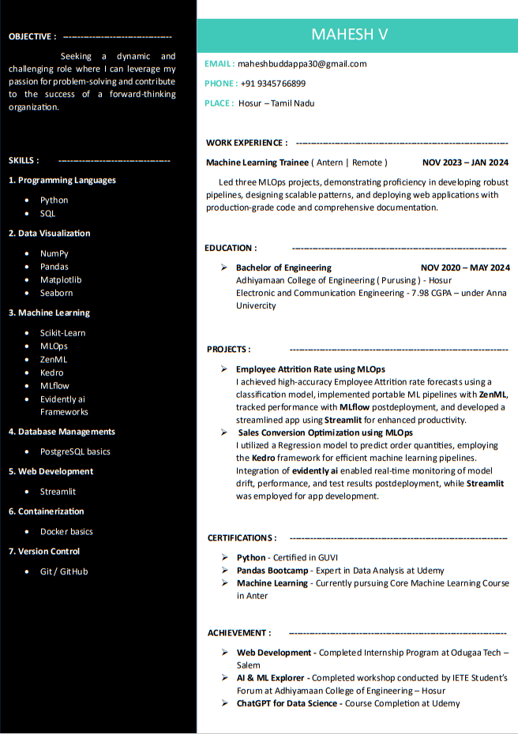

## ✨ About Me :

I'm Mahesh, a dedicated student fueled by a fervor for transforming raw data into actionable insights. My passion lies at the intersection of data science, machine learning, MLOps, and DevOps. Engaged in a relentless pursuit of knowledge, I embark on a journey to not only master these cutting-edge technologies but also seamlessly integrate them to address real-world challenges.

## 🌱 Curiosities :

- 📊 **Data Science:**
Embarking on a mystical journey, I weave spells with data, transforming raw information into strategic insights. Watch as I unravel the enchanting stories hidden within the digits and bytes.

- 🤖 **Machine Learning Magic:**
Venturing into the realms of artificial intelligence, I don the hat of a modern sorcerer, exploring the arcane powers of machine learning. Spells cast in algorithms, conjuring predictions, and unraveling the future.

- 🚀 **DevOps Wizardry:**
In the magical world of DevOps, I wield the wand of automation, enchanting the software development process for unparalleled efficiency. Witness as spells of seamless collaboration and accelerated innovation unfold.

